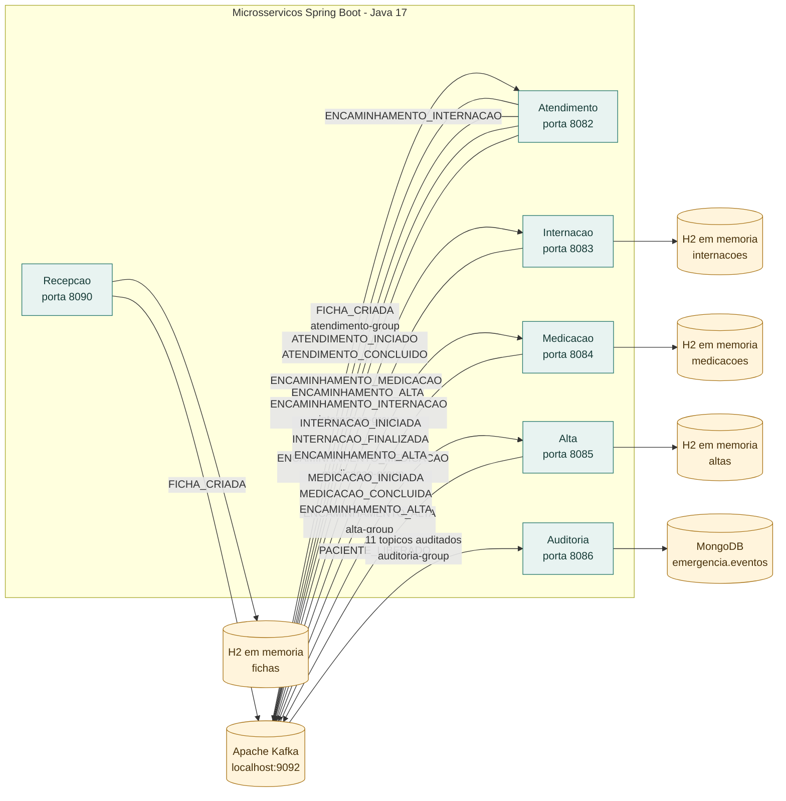

# Emergência Hospitalar com Microsserviços e Kafka

## 1. Sobre o projeto

Este projeto simula o atendimento de pacientes em uma emergência hospitalar. A Recepção cria uma ficha, o Atendimento realiza uma triagem simplificada e publica um encaminhamento para Internação, Medicação ou Alta. Os serviços comunicam as etapas do fluxo por eventos Kafka; a Auditoria consome esses eventos e registra um histórico no MongoDB.

O projeto tem finalidade educacional: permite estudar, no código, microsserviços, comunicação assíncrona, eventos de domínio e intermediários, grupos de consumidores e persistência separada por serviço. As decisões clínicas e os tempos são simulados e não representam um sistema hospitalar real.

## 2. Conceito arquitetural

Na Arquitetura Orientada a Eventos (Event-Driven Architecture, EDA), um serviço comunica que algo aconteceu publicando um evento. Outros serviços interessados podem consumi-lo sem que o produtor precise chamar diretamente cada um deles.

Neste projeto, o caminho de entrada começa com uma requisição HTTP síncrona à Recepção. Depois que a ficha é criada, o restante do fluxo entre os serviços usa mensagens assíncronas no Kafka: a Recepção publica `FICHA_CRIADA`, e o Atendimento consome esse tópico. O Atendimento publica eventos de acompanhamento e um tópico de encaminhamento; Internação, Medicação ou Alta consomem o tópico correspondente.

O serviço que publica é chamado de **producer**; o que recebe uma mensagem de um tópico é um **consumer**. Um **tópico** identifica uma categoria de mensagens, como `ENCAMINHAMENTO_MEDICACAO`. Um **consumer group** identifica um grupo lógico de consumidores: os serviços de negócio usam grupos próprios e a Auditoria usa `auditoria-group`, independente dos grupos de negócio.

O Kafka atua como intermediário entre producers e consumers. Isso reduz a necessidade de chamadas diretas entre os serviços, mas não significa que o projeto implemente todas as garantias possíveis de uma plataforma de eventos. Configuração de retenção, particionamento, autenticação, confirmação de processamento e tolerância a falhas não estão documentadas/configuradas nos arquivos analisados.

## 3. Cenário e fluxo

1. A Recepção recebe os dados do paciente por HTTP, aplica a regra de prioridade, persiste a ficha em H2 e publica `FICHA_CRIADA`.
2. O Atendimento consome a ficha, calcula risco e setor conforme regras simplificadas em código, publica `ATENDIMENTO_INCIADO`, escolhe um encaminhamento e publica `ATENDIMENTO_CONCLUIDO`.
3. O tópico de encaminhamento é consumido por Internação, Medicação ou Alta. Internação e Medicação também podem publicar `ENCAMINHAMENTO_ALTA`, que leva o relatório à Alta.
4. Internação publica eventos de início e finalização. Medicação publica eventos de início e conclusão. A Alta salva o registro e publica `PACIENTE_LIBERADO`.
5. A Auditoria consome os tópicos listados neste README em paralelo aos consumers de negócio e salva uma representação dos registros recebidos no MongoDB.

`ATENDIMENTO_CONCLUIDO` indica que o Atendimento concluiu sua etapa de triagem; não significa que as etapas posteriores de Internação ou Medicação já terminaram. O código chama o evento inicial de `ATENDIMENTO_INCIADO`, com essa grafia.

## 4. Arquitetura



O diagrama mostra que o broker é compartilhado e que os bancos H2 são locais e independentes por serviço. Atendimento não possui banco configurado. A Auditoria consome cada tópico em um grupo separado e persiste somente no MongoDB. Não há configuração Docker/Compose encontrada no repositório.

## 5. Eventos e tópicos

| Tópico | Producer | Consumers encontrados | Papel no fluxo |
| --- | --- | --- | --- |
| `FICHA_CRIADA` | Recepção | Atendimento (`atendimento-group`), Auditoria (`auditoria-group`) | Ficha criada, com chave Kafka `idFicha`. |
| `ATENDIMENTO_INCIADO` | Atendimento | Auditoria (`auditoria-group`) | Notificação de início da etapa de atendimento. A grafia é literal no código. |
| `ENCAMINHAMENTO_INTERNACAO` | Atendimento | Internação (`internacao-group`), Auditoria (`auditoria-group`) | Relatório de triagem encaminhado à Internação. |
| `ENCAMINHAMENTO_MEDICACAO` | Atendimento | Medicação (`medicacao-group`), Auditoria (`auditoria-group`) | Relatório de triagem encaminhado à Medicação. |
| `ENCAMINHAMENTO_ALTA` | Atendimento, Internação e Medicação | Alta (`alta-group`), Auditoria (`auditoria-group`) | Relatório encaminhado à Alta. |
| `ATENDIMENTO_CONCLUIDO` | Atendimento | Auditoria (`auditoria-group`) | Resultado da triagem; não indica conclusão dos outros serviços. |
| `INTERNACAO_INICIADA` | Internação | Auditoria (`auditoria-group`) | Registro da internação criada. |
| `INTERNACAO_FINALIZADA` | Internação | Auditoria (`auditoria-group`) | Registro da internação marcada como finalizada. |
| `MEDICACAO_INICIADA` | Medicação | Auditoria (`auditoria-group`) | Registro da medicação criada. |
| `MEDICACAO_CONCLUIDA` | Medicação | Auditoria (`auditoria-group`) | Registro de conclusão da etapa simulada de medicação. |
| `PACIENTE_LIBERADO` | Alta | Auditoria (`auditoria-group`) | Registro publicado pela Alta após salvar a alta. |

Os tópicos com prefixo `ENCAMINHAMENTO_` são derivados do valor de encaminhamento no relatório. Para mensagens de Atendimento, Internação e Medicação, o producer adiciona o header Kafka `origem`; a Recepção e a publicação de `PACIENTE_LIBERADO` não adicionam esse header.

## 6. Tecnologias

- **Java 17** e **Spring Boot 3.2.5**: implementação dos seis serviços.
- **Spring Web**: entrada HTTP da Recepção; os demais módulos também declaram o starter Web.
- **Apache Kafka** e **Spring Kafka**: publicação e consumo de mensagens. O endereço configurado é `localhost:9092`.
- **Spring Data JPA** e **H2**: persistência relacional em memória na Recepção, Internação, Medicação e Alta.
- **Spring Data MongoDB** e **MongoDB**: persistência dos documentos de Auditoria no banco `emergencia`, coleção `eventos`, com URI `mongodb://localhost:27017/emergencia`.
- **Jackson**: serialização e leitura de payloads JSON.
- **Maven**: build; cada módulo contém `mvnw.cmd`.
- **SLF4J e saída padrão**: o código usa logger em alguns pontos e `System.out`/`System.err` em outros; não há configuração de logging centralizado encontrada.

Docker não aparece como tecnologia configurada no repositório: não foram encontrados Dockerfiles ou arquivos Compose.

## 7. Execução local

Requisitos identificados nas configurações: JDK 17, um broker Kafka acessível em `localhost:9092` e MongoDB acessível em `localhost:27017` para executar Auditoria. Não há instruções ou arquivos no repositório que provisionem esses serviços externos.

Inicie primeiro Kafka e MongoDB (este último é necessário para Auditoria). Depois, em terminais separados, execute os módulos desejados. Exemplo no PowerShell:

```powershell
cd recepcao
.\mvnw.cmd spring-boot:run
```

Repita o comando dentro de `atendimento`, `internacao`, `medicacao`, `alta` e `auditoria`. Portas configuradas:

| Serviço | Porta |
| --- | ---: |
| Recepção | 8090 |
| Atendimento | 8082 |
| Internação | 8083 |
| Medicação | 8084 |
| Alta | 8085 |
| Auditoria | 8086 |

Os bancos H2 são `mem` e não mantêm dados após o encerramento do processo. A aplicação Recepção configura o console H2 em `/h2-console`; os outros serviços que usam H2 também configuram esse caminho.

## 8. Documentação dos Fluxos

- [Recepção](docs/recepcao.md)
- [Atendimento](docs/atendimento.md)
- [Internação](docs/internacao.md)
- [Medicação](docs/medicacao.md)
- [Alta](docs/alta.md)
- [Auditoria](docs/auditoria.md)